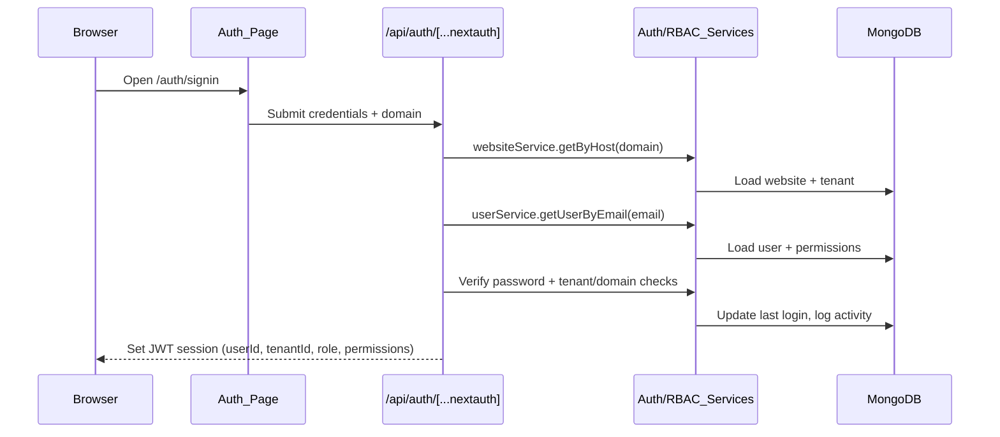
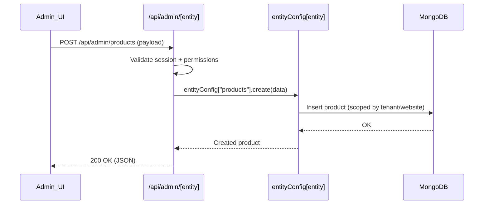

## KalpTree Architecture

KalpTree is a multi‑tenant website, ecommerce, and admin platform built on Next.js App Router. It serves public marketing/commerce sites, a powerful admin dashboard, and a drag‑and‑drop page builder on top of a shared MongoDB database with tenant‑aware auth and RBAC.

### Tech stack

- **Framework**: Next.js (App Router), React
- **Styling**: Tailwind CSS, custom design system
- **State management**: Redux Toolkit + React‑Redux
- **Forms & validation**: React Hook Form, Zod
- **Auth**: NextAuth (credentials, JWT) with domain‑aware login
- **Database**: MongoDB (`mongodb` driver)
- **Editor / builder**: GrapesJS and custom blocks/templates
- **Email & notifications**: Nodemailer, `sonner` toasts
- **Other services**: Stripe/Razorpay (billing), AWS S3 (media) – wired via API routes and `lib/*` services

### High‑level system diagram

```mermaid
flowchart LR
  user[User] --> frontend[NextAppRouter_Frontend]
  frontend --> publicRoutes["Public & client routes\n(src/app/(frontend), builder, auth)"]
  frontend --> adminRoutes["Admin dashboard\n(src/app/admin)"]

  publicRoutes --> api[Next_API_Routes\n(src/app/api)]
  adminRoutes --> api

  api --> services["Domain services\n(src/lib/*)"]
  services --> db[(MongoDB)]

  services --> external["External services\n(Email, Billing, Storage)"]
```

---

## App router structure (`src/app`)

At a high level the app is split into:

- **Public & client‑facing routes**: route groups under `(frontend)` and `(localpages)` that render websites, product/catalog views, and localized pages.
- **Admin dashboard**: `admin/` and nested `admin/websites/[website]/...` routes for tenant and website management.
- **Builder**: `builder/[id]/` for the page builder experience.
- **Auth & onboarding**: `auth/`, onboarding flows, and utility pages.

Example (non‑exhaustive) structure:

```text
src/app/
├── layout.tsx                     # Root layout, Redux + theme + toasts
├── (frontend)/
│   ├── (clientpages)/[lang]/      # Tenant websites by language
│   │   ├── page.tsx               # Homepage for a locale
│   │   ├── [slug]/page.tsx        # Generic content pages
│   │   ├── [slug]/builder/page.tsx
│   │   ├── [slug]/comingsoon/page.tsx
│   │   ├── product/[slug]/page.tsx
│   │   └── product-category/[...slug]/page.tsx
│   └── (localpages)/homee/...
│
├── admin/
│   ├── page.tsx                   # Admin overview
│   ├── users/, agencies/, business/, products/, ecommerce/, ...
│   └── websites/[website]/        # Per‑website admin surface
│       ├── overview/, branding/, domain/, ecommerce/, bookings/
│       ├── marketing/, products/, website/, users/, settings/
│       └── website/header/, website/footer/, website/navigation/, ...
│
├── builder/[id]/page.tsx          # GrapesJS‑based page builder
├── auth/signin/page.tsx
└── api/                           # See API architecture below
```

The root `layout.tsx` wraps everything in `ReduxProvider`, `AdminThemeProvider`, and registers global styles and the GrapesJS CSS.

---

## API architecture (`src/app/api`)

All backend logic is exposed via Next.js route handlers. Most routes are thin and delegate to services in `src/lib/*`.

Key areas:

- **Auth & session**
  - `api/auth/[...nextauth]/route.ts`: NextAuth credentials provider using `authConfig`.
  - `src/lib/auth/*`: auth config, session helpers, user service.
  - `api/session/{tenant,agency,website}/route.ts`: resolve current context.

- **Admin APIs**
  - `api/admin/[entity]/route.ts`: **dynamic entity CRUD** (see dedicated section below).
  - Other focused routes such as:
    - `api/admin/product/route.ts`, `api/admin/categories/route.ts`, `api/admin/branding/route.ts`
    - `api/admin/business/route.ts`, `api/admin/agency/route.ts`
    - `api/admin/llmSetting/route.ts`, `api/admin/bookings/calender/route.ts`

- **Domain & tenant resolution**
  - `api/domain/[host]/route.ts`, `api/domain/website/route.ts`
  - `api/domain/current/route.ts`, `api/domain/current/branding/route.ts`
  - Used to map incoming hosts to websites/tenants and to load branding.

- **Public content & ecommerce**
  - `api/public/pages/[slug]/route.ts`, `api/public/posts/[slug]/route.ts`
  - `api/public/products/[slug]/route.ts`
  - `api/pages/route.ts`, `api/pages/[id]/route.ts`, `api/posts/route.ts`
  - `api/product/route.ts`, `api/product_categories/route.ts`, `api/product_variants/route.ts`

- **Media, templates, and utilities**
  - `api/media/route.ts`, `api/media/[id]/route.ts`, `api/media/s3upload/route.ts`
  - `api/template/route.ts`
  - `api/dev/health/route.ts`, `api/dev/verify-db/route.ts` (internal checks)

Typical flow:

```text
HTTP request
  → src/app/api/.../route.ts
    → calls service in src/lib/* (e.g. website-service, tenant-service, material/*)
      → reads/writes MongoDB
      → may talk to external services (email, billing, storage)
  ← JSON response
```

---

## Core domains and modules (`src/lib`, `src/modules`, `src/models`)

### Auth & session

- **Where**: `src/lib/auth/*`
  - `auth-config.ts` defines `authConfig` for NextAuth (credentials, JWT).
  - `user-service.ts` handles user lookup, password verification, and last‑login updates.
  - `session.ts` and `auth/index.ts` provide helpers for accessing the current user/session.
- **Highlights**:
  - Domain‑aware login using `websiteService.getByHost()` and `tenantService.getTenantById()`.
  - JWT tokens enriched with `userId`, `tenantId`, `role`, and `permissions`.

### RBAC and tenant access

- **Where**: `src/lib/rbac/*`
  - `rbac-service.ts`: central RBAC service for permission checks, tenant access, and activity logging.
  - `roles.ts`: role hierarchy and default permission sets.
- **Responsibilities**:
  - Update and validate user roles and permissions.
  - Determine whether a user can access or manage a given tenant.
  - Provide UI configuration per role/tenant and log important actions.

### Multi‑tenancy & domain routing

- **Where**:
  - `src/lib/tenant/tenant-service.ts`
  - `src/lib/websites/website-service.ts`
  - `src/app/api/domain/*`
- **Responsibilities**:
  - Map incoming hostnames to websites and tenants.
  - Manage tenant hierarchy (admin, franchise, client tenants).
  - Resolve “current website/tenant” context for both public pages and admin.

### Website & content

- **Where**: `src/modules/website/*`, `src/lib/websites/website-service.ts`, `src/app/(frontend)/*`
- **Responsibilities**:
  - CRUD for pages, posts, SEO metadata, navigation, header/footer, redirects, and forms.
  - Expose public and admin APIs for managing website content.
  - Provide page data to the builder and renderers in `(frontend)` routes.

### Ecommerce & catalog

- **Where**:
  - `src/lib/material/*` (e.g. `product.ts`, `category.ts`, `product_brand.ts`, `product_attribute.ts`,
    `attributessets.ts`, `product_type.ts`, `product_type_category.ts`)
  - Related APIs in `src/app/api/product*`, `src/app/api/product_categories*`, `src/app/api/product_variants*`.
- **Responsibilities**:
  - Manage products, brands, categories, attribute sets, product types, and type categories.
  - Handle pricing rules, variants, shipping, orders, and carts (via associated admin and website routes).

### Builder / editor

- **Where**:
  - `src/app/builder/[id]/page.tsx`
  - Editor components under `src/components/editor/*` (GrapesJS integration, blocks, sidebars).
  - Utilities under `utils/*` for block definitions and configuration.
- **Responsibilities**:
  - Provide a drag‑and‑drop editor for website pages.
  - Persist page structure and content for rendering in client‑facing routes.

### Billing & subscriptions

- **Where**:
  - `src/lib/billing/subscription-service.ts`
  - `src/app/api/subscription/route.ts` and related APIs.
- **Responsibilities**:
  - Manage subscription records, plan changes, and billing integration hooks.

---

## Dynamic entity system (admin CRUD)

The dynamic entity system powers a large set of admin CRUD screens through a single API route and a shared configuration. Instead of hard‑coding a separate route and switch statement for each entity, operations are routed through `entityConfig`.

### Overview diagram

```text
User → /admin/[entity] UI (per‑entity admin pages)
    → calls /api/admin/[entity] (GET/POST/PATCH/DELETE)
      → validates entity with isValidEntity()
      → dispatches to entityConfig[entity][operation]
      → executes MongoDB operations in src/lib/material/*
```

### Backend configuration (`src/lib/entities/entityConfig.ts`)

```ts
export const entityConfig: Record<string, EntityOperations> = {
  category: { create: createCategory, list: listCategories, getById: getCategoryById, update: updateCategory, delete: deleteCategory },
  brand: { create: createBrand, list: listBrands, getById: getBrandById, update: updateBrand, delete: deleteBrand },
  attribute: { create: createAttribute, list: listAttributes, getById: getAttributeById, update: updateAttribute, delete: deleteAttribute },
  products: { create: createProduct, list: listProducts, getById: getProductById, update: updateProduct, delete: deleteProduct },
  attributessets: { create: createAttributessets, list: listAttributeSets, getById: getAttributeSetsById, update: updateAttributeSets, delete: deleteAttributeSets },
  producttype: { create: createProductType, list: listProductTypes, getById: getProductTypeById, update: updateProductType, delete: deleteProductType },
  producttypecategory: { create: createProductTypeCategory, list: listProductTypeCategories, getById: getProductTypeCategoryById, update: updateProductTypeCategory, delete: deleteProductTypeCategory },
};
```

- Each entity exposes the same operations: `create`, `list`, `getById`, `update`, `delete`.
- Implementations live in `src/lib/material/*.ts` (e.g. `category.ts`, `product_brand.ts`, `product_attribute.ts`, `product.ts`, `attributessets.ts`, `product_type.ts`, `product_type_category.ts`).
- `isValidEntity(entity)` ensures only configured entities are reachable.

### Dynamic admin API (`src/app/api/admin/[entity]/route.ts`)

The dynamic route handler:

- Parses the `entity` from the URL.
- Checks `isValidEntity(entity)` against `entityConfig`.
- Maps HTTP verbs to operations (`GET` = `list` or `getById`, `POST` = `create`, `PATCH` = `update`, `DELETE` = `delete`).
- Passes through relevant IDs and `websiteId`/tenant context to the underlying service.

This design removes the need for large `switch` statements across many entities and centralizes CRUD wiring.

### Frontend integration

- Admin UI components under `src/app/admin/*` and `src/app/admin/websites/[website]/*` call `/api/admin/[entity]` for list/create/update/delete.
- Table, form, and modal components can be reused across entities because the backing API shares a uniform contract.
- Additional entities can be added by:
  1. Implementing operations in `src/lib/material/*.ts`.
  2. Registering them in `entityConfig`.
  3. Wiring or reusing the appropriate admin UI screens.

---

## Cross‑cutting concerns

### Auth, RBAC, and multi‑tenancy (conceptual flow)



- Subsequent admin and builder requests read the session, use RBAC to authorize actions, and apply tenant filters when querying MongoDB.

### Typical admin entity request



---

## Extending the system (developer guide)

- **Add a new admin domain**
  - Create UI routes/components under `src/app/admin/...` or `src/app/admin/websites/[website]/...`.
  - Add corresponding services in `src/lib/*` and API handlers under `src/app/api/admin/...`.

- **Add a new dynamic entity**
  - Implement MongoDB operations in `src/lib/material/<entity>.ts`.
  - Register the entity in `src/lib/entities/entityConfig.ts` with the standard CRUD operations.
  - Point admin UI components at `/api/admin/[entity]` for data fetching and mutations.

- **Add a new public page type or template**
  - Extend the website modules and APIs (e.g. `pages`, `posts`, `templates`).
  - Add or update builder blocks/templates and rendering logic in `(frontend)` routes.

Together, these patterns provide a scalable foundation for adding new tenants, websites, entities, and features while keeping the architecture consistent and maintainable.
